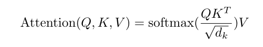
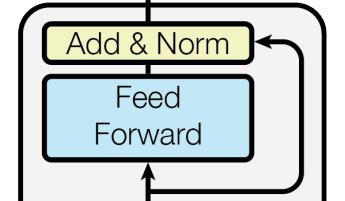

# Small GPT

Reproduced a transformer architecture with some modifications following [Vaswani et al. 2017](https://arxiv.org/pdf/1706.03762)

P.S Model is not yet trained, as it takes 38 hours without a GPU. Maybe soon though.

## My model

### 1. Implemented multihead attention



```python
class MultiHeadAttention(nn.Module):
    
        def __init__(self, num_heads, head_size):
            super().__init__()
            self.heads = nn.ModuleList([Head(head_size) for _ in range (num_heads)])
            self.proj = nn.Linear(n_embed, n_embed)
            self.dropout = nn.Dropout(dropout)
        
        def forward(self, x):
            out = torch.cat([h(x) for h in self.heads], dim=-1)
            out = self.dropout(self.proj(out))
            return out


class Head(nn.Module):
    def __init__(self, head_size):
        super().__init__()
        self.key = nn.Linear(n_embed, head_size, bias=False)
        self.query = nn.Linear(n_embed, head_size, bias=False)
        self.value = nn.Linear(n_embed, head_size, bias=False)
        self.register_buffer('tril', torch.tril(torch.ones(block_size, block_size)))
        self.head_size = head_size
        self.dropout = nn.Dropout(dropout)
        
    def forward(self, x):
        B, T, C = x.shape
        k = self.key(x)
        q = self.query(x)
        
        wei = q @ k.transpose(-2, -1) * self.head_size**-0.5
        
        wei = wei.masked_fill(self.tril[:T, :T]==0, float("-inf"))
        wei = F.softmax(wei, dim=-1)
        wei = self.dropout(wei)
        v = self.value(x)

        out = wei @ v
        
        return out 
```

### 2. Feed forward is a simple: Linear -> ReLU -> Linear -> Dropout

```python
class FeedForward(nn.Module):
    def __init__(self, n_embed):
        super().__init__()
        self.net = nn.Sequential(
            nn.Linear(n_embed, 4*n_embed), 
            nn.ReLU(),
            nn.Linear(4*  n_embed, n_embed),
            nn.Dropout(dropout)
        )
    
    def forward(self, x):
        return self.net(x)
```

- Diviation from the paper is here in a Dropout layer that prevents overfitting the data

### 3. Add & Norm Block

```python
class Block(nn.Module):
    def __init__(self, n_embed, n_head):
        super().__init__()
        
        head_size = n_embed//n_head
        self.sa = MultiHeadAttention(n_head, head_size)
        self.ffwd = FeedForward(n_embed)
        self.ln1 = nn.LayerNorm(n_embed)
        self.ln2 = nn.LayerNorm(n_embed)

        
    def forward(self, x):
        x += self.sa(self.ln1(x)) # Layer norm is applied before attention
        x += self.ffwd(self.ln2(x)) # And before MLP
        return x
```



- In the original paper Add & Norm layer is applied after Attention or MLP, but I applied it before following the latest practices  
